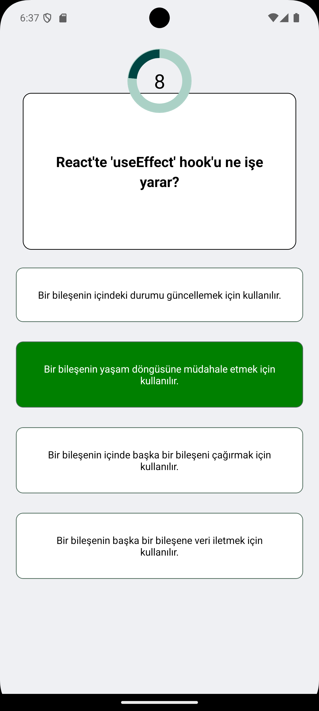

# Quiz Uygulaması

Bu, React Native Expo ve Firebase ile geliştirilmiş bir Quiz Uygulamasıdır. Uygulama, kullanıcıların quiz yapmasına, skorlarını kaydetmesine ve bir liderlik tablosunu görüntülemesine olanak tanır.

## Özellikler

- Kullanıcıların kullanıcı adlarını girebilecekleri ve quiz başlatabilecekleri ana ekran.
- Her soru için zamanlayıcıya sahip quiz ekranı.
- Doğru cevapları gösterme ve skoru takip etme.
- Quiz sonuçlarını Firebase'e kaydetme.
- En iyi skorları ve liderlik tablosunu gösteren sonuç ekranı.

## Ekran Görüntüleri

### Ana Ekran


### Quiz Ekranı


### Quiz Ekranı - Soru 2



### Sonuç Ekranı


## Kurulum

### Gereksinimler

- Node.js
- Expo CLI

### Depoyu Klonlayın

```bash
git clone https://github.com/kullaniciadiniz/quiz-uygulamasi.git
cd quiz-uygulamasi
```
